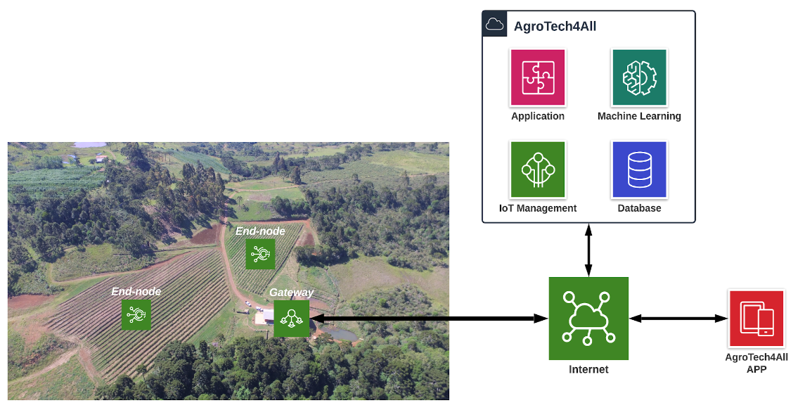

.. ATL-100 Firmware documentation master file, created by
   sphinx-quickstart on Tue Jan 14 18:38:18 2025.
   You can adapt this file completely to your liking, but it should at least
   contain the root `toctree` directive.

ATL-100 Firmware
================

**ATL-100** is a multiparametric station developed by `AgroTechLab (*Technology Development Laboratory for Agribusiness*) 
<https://agrotechlab.lages.ifsc.edu.br>`_ of `IFSC (*Federal Institute of Santa Catarina*) <https://www.ifsc.edu.br>`_.

It can be used as meteorological station, agrometeorological station, hydrological station, aquaculture station, 
tide gauge station or fire monitoring station (forest or urban environment).

The data collected in the field by the **ATL-100** stations are sent to the **AgroTechLab Platform** where they are 
filtered, stored and processed. These data are sources for insights which both (data and insights) can be accessed by 
users through websites or mobile applications.

.. toctree::
   :name: mastertoc
   :maxdepth: 2
   :caption: Table of Contents:

   authors_license
   changelog
   versions_support
   tech_specs
   source_code_docs